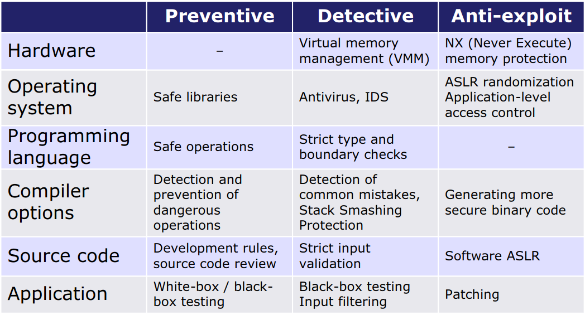
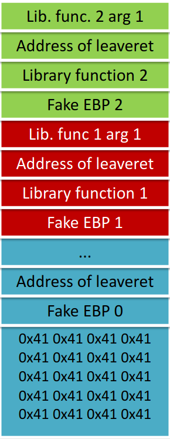

## Memory corruption

+ From programmers for hackers!
+ C/C++ is **memory unsafe**
  + is almost impossible to make a memory safe C/C++ code

### Memory exploiting: corruption
+ A pointer megváltoztatása valami extrém értékre
  + array pointer növelése: buffer overflow
  + Indexing megváltoztatása: integer overflow
  + Elrontani a memória foglalást: null pointer jön létre
  + Ha törlik az objektumot amire mutat a mutató: dangling pointer
+ Az invalid pointerre való hivatkozás: error trigering
  + Spatial error: egy out of bounds pointerre hivatkozunk
  + Temporal error: dangling pointerre való hivatkozás
  + Read/Write with the use of pointer

### Támadások:
+ Információ szivárogtatás
  + info szivárogtatás hogy a támadást végre tudjuk hajtani, pl cím megszerzése az ASLR kikerüléséhez
+ Data only attack
  + adatok módosítása a több kontroll/jogosultság érdekében
  + nincs módosítva pointer
+ Control flow hijack attack
  + code pointer megváltoztatva hogy más legyen a control flow
  + Ha csak közvetetten tudja irányítani akkor control flow intergrity CFI policy megfogja
  + Shell code injection
  + code reuse attack: Return-To-Libc
+ Code corruption attack
  + program kódját átírni

### Intel x86 fő regiszterek
+ regiszter: 32 bites tár a mikroproceszorban
+ fő regiszterek: `eax, ebx ecx edx esi edi`
+ speciális regiszterek:
  + esp -- stack pointer
  + ebp -- stack frame, funkció kontextusa
  + eip -- instruction pointer, következő instrukció címe
+ Adat címzés:
  + direkt: `esp` vagy `0x07B3`
  + indirekt: hol van az érték: `[ecx]`,  `[0x0012FE10]` vagy `[ebp+12]`

### Intel x86 operátorok
+ MOV
+ ADD
+ SUB
+ CMP
+ AND
+ OR
+ XOR

### Intel x86 flag-ek
+ ZF -- zero flag -- utolsó művelet eredménye 0
+ CF -- carry flag -- utolsó műveletből van carry vagy borrow
+ SF -- sign flag -- utolsó művelet eredménye negatív előjelű
+ OF -- overflow flag -- utolsó művelet túlcsordult
+ PF -- parity flag -- ha LSB ha az utolsó operáció eredménye páros sok egyest tartalmaz

### Intel x86 control instrukciók
+ JMP: megváltoztatja a következő végrehajtandó kód címét
+ J<cond>: jmp ha igaz a cond
+ PUSH/POP: stack művelet -- esp regiszter
+ LEAVE: funckiók végén
+ CALL: tárolja a mostani visszatérési címet majd ugrik a megadott címre
+ RET: POP eip

### Memória felépítése:

A Stack fentről lefelé nagyobbodik míg a az adatszegmens alulről felfelé
+ Stack:
  + lokális változók
  + hívásokhoz szükságes értékek
+ Data szegmens:
  + Heap
  + .bss: Nem inicializált globális és statikus változók
  + .data: inicializált globálos és statikus változók

### Stack
+ a stack több úgynevezett stackframe-ből áll ezeknek a felépítése fentről lefelé:
  + Function params
  + Return address
  + Saved EBP -- funkció kontextusa -- (SFP)
  + lokális változók
  + még fel nem használt memória

### Stack frame
+ fentről lefelé nő, az az esp pointertől a kisebb memória cím felé
+ ESP a stackframe tetejére mutat

### Hívási konvenciók
+ cdecl: arguments passed from right to left, caller cleans
+ pascal: arguments passed left to right, called function cleans
+ stdcall: like pascal but arguments are passed right to left
+ fastcall: like stdcall but first two values passed in registers
+ thiscall: used in c++, this pointer passed

### Function call prologue and epilogue
+ prologue:
  + belépéskor menti a stackbe az ebp -- funkció kontextus -- értékét
  + ebp = a stack pointerrel (esp)
  + elmozgatja a stackpointert lefelé (sub ebp 0xc)
+ Epilogue
  + kilépéskor
  + leave
  + ret

### Buffer overflow
+ buffer határát átlépjük, azaz túlírjuk ennek hatására más memória területekbe beleírunk
+ Stack/Heap overflow
+ Program meghal jó esetben
  + seg fault -- linux
  + access code violation -- windows
+ Exploit lényege hogy a fontos értékeket átírjuk

### Stack overflow
+ Mikor történik:
  + a program user által adott adatot másol anélkül hogy méretét ellenőrizze
+ Veszélyes funkciók:
  + strcpy, sprintf, strcat, gets, fgets, memcpy
+ Stacken átirja a dolgokat, pl return address
  + ott folytatja a futást ahol mi akarjuk pl saját kód is van a bemenetben
  + NOP sled: ne csinálj semmit `0x90` instrukciók egymás után, így nem kell annyira pontosan célozni a ebp felűlirásnál

### Hova rakjuk a shellcode-t?
+ Lokális buffer: itt fontos hogy a buffer is futattható legyen
+ Enviroment variables: stack futattható kell legyen, kicsi kódú támadások
+ Egy másik funkció címére: ha stack nem futattható is lehet shellcode-al dolozni csak több framet kell rakni a stackre

    <pre>
    ⣿⣿⣿⣿⣿⣿⣿⣿⣿⣿⣿⣿⣿⣿⣿⣿⣿⣿⣿⣿⣿⣿⣿⣿⣿⣿⣿⣿⣿⣿⣿⣿⣿⣿⣿⣿⣿⣿⣿⣿⣿⣿⣿⣿⣿⣿⣿⣿⣿⣿
    ⣿⣿⣿⣿⣿⣿⣿⣿⣿⣿⣿⣿⣿⠛⠛⠛⠛⠛⠛⢛⣿⠿⠟⠛⠛⠛⠛⠛⠛⠿⠿⣿⣟⠛⠛⠛⢿⣿⣿⣿⣿⣿⣿⣿⣿⣿⣿⠿⠿⣛
    ⣿⣿⣿⣿⣿⣿⣿⣿⣿⣿⣿⣿⣿⣇⠀⠀⠀⠀⢠⡿⠁⣀⢀⢀⠀⣀⠀⣀⠀⠀⡀⣀⠙⢷⡀⠺⠿⣿⣿⣿⣿⣿⣿⣿⣿⡿⠃⣰⣿⣿
    ⣿⣿⣿⣿⣿⣿⣿⣿⣿⣿⣿⣿⣿⣿⠀⠀⠀⠀⢸⡇⢰⢿⣿⢻⡿⣿⢿⣯⡼⣧⡇⣿⡆⢸⡇⠀⠀⠙⣿⣿⣿⣿⣿⣿⣿⠃⢀⣿⣿⣿
    ⣿⣿⣿⣿⣿⣿⣿⣿⣿⣿⣿⣿⣿⣿⣄⣀⡀⠀⠘⢷⣀⠀⠀⠀⠀⠉⠀⠈⠀⠀⠀⠀⢀⣼⠃⠀⠀⠀⠉⠛⠿⢿⣿⣿⡏⠀⣼⣿⣿⣿
    ⣿⣿⣿⣿⣿⣿⣿⣿⡿⠟⠉⠀⡀⠀⠀⠉⠛⢷⣄⠈⢙⡷⠀⠀⣠⣤⣤⣤⣤⣤⡴⠾⠋⠁⣠⡶⠶⠶⠶⠶⣤⡀⠀⣿⡇⠀⣿⣿⣿⣿
    ⣿⣿⣿⣿⣿⣿⣿⠏⠀⠀⠐⠉⠉⠁⠀⠀⠀⠀⠹⣶⠻⠟⠛⠛⠋⠀⠀⠀⡏⠀⠀⠀⠀⢠⡏⣠⣤⠤⠤⣄⡈⢻⡄⣿⡇⠀⣿⣿⣿⣿
    ⣿⣿⣿⣿⣿⣿⣿⠀⠀⠀⢰⡖⠲⣶⣶⢤⡤⠤⣤⣿⡆⠀⠀⠀⠀⠀⠀⠀⡇⠀⠀⠀⠀⡾⠀⠻⣷⣶⡶⠾⠃⠈⣿⣿⡇⠀⣿⡿⠿⢿
    ⣿⣿⣿⣿⣿⣿⣿⣆⠀⠀⢀⣉⣛⠛⠉⢠⡙⠲⢿⣿⠃⠀⠀⠀⠀⠀⠀⢰⠇⠀⠀⠀⢰⡇⠀⠀⠀⠀⠀⠀⠀⠀⢹⣿⡇⠀⣿⣧⣤⣿
    ⣿⣿⣿⣿⣿⣿⣿⣿⣷⣤⣌⠛⠿⠿⠖⣎⣤⣶⡛⠁⠀⠀⠀⠀⠀⠀⠀⢸⠀⠀⠀⠀⣾⠀⠀⠀⠀⠀⠀⠀⠀⠀⢸⣿⡇⠀⣿⣿⣿⣿
    ⣿⣿⣿⣿⣿⣿⣿⠟⠋⠉⠙⠛⠻⣿⣿⣿⣿⣿⣿⣧⠀⠀⠀⠀⠀⠀⠀⢸⠀⠀⠀⢠⡇⠀⠀⠀⠀⠀⠀⠀⠀⠀⢸⣿⡇⠀⣿⣿⣿⣿
    ⣿⣿⣿⣿⣿⡿⠁⠀⠠⢤⡀⠀⢀⡬⠟⣻⣿⣯⠍⠻⣆⠀⠀⠀⠀⠀⠀⢸⠀⠀⠀⢸⡇⠀⣠⠶⠶⠶⢶⡀⠀⠀⢸⣿⡇⠀⣿⣿⣿⣿
    ⣿⣿⣿⣿⣿⠃⠀⡀⠀⠀⠉⠓⠋⠀⠀⣳⣾⡴⠂⠀⢹⡆⠀⠀⠀⠀⢀⣸⣰⣛⣛⣺⣀⣀⣸⣆⣀⣀⣸⣇⣀⣀⣸⣿⡇⠀⣿⣿⣿⣿
    ⣿⣿⣿⣿⡏⠀⠀⠉⠓⢦⣄⣀⣠⣴⣿⣷⣼⣵⣻⡄⠀⡇⠀⠀⠀⠀⢸⠀⠀⠀⠀⠀⠀⠀⠀⠀⠀⠀⠀⠀⠀⠀⠀⠀⠀⠀⣿⣿⣿⣿
    ⣿⣿⣿⣿⠀⠀⠀⠀⠀⠀⠀⠉⢹⣿⣿⣿⣿⣿⣍⣀⣸⣧⣤⣤⣤⣤⣼⣄⣀⣀⣀⡀⠀⢀⣀⣠⣤⣤⣤⣤⣤⣤⣀⣀⣀⠀⠀⠀⠀⠀
    ⠛⠛⢻⡏⠀⠀⠀⠀⠀⠀⠀⠀⣾⠀⠀⠀⠀⠀⠈⠉⠁⠀⠀⠀⠀⠀⠉⠉⠉⠛⠛⠛⠛⠛⠉⠉⠀⠀⠀⠀⠀⠉⠉⠉⠛⠛⠛⠛⠛⠛
    ⣀⣀⣸⠁⠀⠀⢀⣶⣶⣦⠀⢀⣟⣀⣀⣀⣀⣀⣀⣀⣀⣀⣀⣀⣀⣀⣀⣀⣀⣠⣄⣀⣀⣀⣀⣀⣀⣀⣀⣀⣀⣀⣀⣀⣀⣀⣀⣀⣀⣀
    </pre>
   

### Buffer overflow mitigation
Különböző fajtájú megoldások:

### Stack smashing protection
Oprendszerenként változó

+ Linux:
  + random canary value
  + buffer pointer a stack tetejére másolja
+ Windows:  
  + canary itt: randomVal XOR ebp

Canary

      <pre>
      Canary: random érték ami ha megváltozott akkor az jelzi hogy ott valami nincs rendben, pl itt mivel a canary random ezért nem lehet előre kitaálni így ha a buffer overflow segítségével probálunk felűlírni dolgokat akkor azt a canary értékének változásával észrevehetjük.  
      </pre>
 

### ASLR -- Address Space Layout/Load Randomization
+ a stack és a heap egy random értékkel el van tolva
+ OS szintű ASLR:
  + random értékkel eltolva :
    + a futtatható kódok kezdőcime
    + könytvárak címe
    + Stack és Heap címe
  + CON:
    + 32 bit az nem add elég mozgás teret: csak 64 biten jó
    + data corruption ellen nem jó

### Date execution prevention
+ Non-executable stack
  + shellcode-ot megállítja
  + harver alapú megoldás esetén szükséges hogy a processzor támogassa az NX bitet
  + Szoftver alapú: emulációval

### Return to libC
+ egy létező függvényt hívunk meg amely része a könyvtárnak
+ pl: system() hatására kapunk egy shell-t :D
+ Védekezés:
  + NX
  + csak olyan library funkciók legyenek a programban amik tényleg kellenek

### Return to LibC with Fake Frames

+ az első funkció (kék) futása közben elérjük hogy epilógus során irja felül az EBP-t egy fake return address-el
+ az x-edik funkció az x+1-edik funkcióra mutató EBP-t hozza létre

##ARM MACHINE CODE, MEMORY LAYOUT AND STACK OPERATIONS
+ ARM -- Advanced Risk Machine
+ 16x32bit register: R0,...,R12,SP,LR,PC)
+ Special purpose registers:
  + SP -- stack pointer
  + LR -- link register, return address itt található
  + PC -- Program counter, következő utasítás
+ instrukció szettek:
  + ARM
    + 32 bit hosszú
    + feltételes végrehajtás
    + indexelt hozzáférési módok
  + Thumb
    + jobb code density mint ARM esetén
    + 16 bit hosszú

### ARM fontos instrukciók
+ Minden instrukció rendelkezik egy condició résszel ami a feltétele hog végrehajtódjon
+ MOV
+ ADD
+ SUB
+ CMP
+ AND
+ ORR
+ EOR

### ARM kontroll funkciók
+ Minden instrukció rendelkezik egy condició résszel ami a feltétele hog végrehajtódjon
+ B addr: PC = addr
+ BL addr: LR = PC és PC = addr
+ BX Rm: PC=Rm, attól függően hogy Thumbot vagy ARM használjuk a 0dik bit be van állítva egyre vagy sem
+ BLX addr
  BLX Rm: LR = PC és utána szimpla Rm

### ARM Feltétel mezők
+ EQ -- z set
+ NE -- Z Clear
+ CS/HS -- C set
+ CC/LO -- C clear
+ MI -- N set
+ PL -- N clear
+ VS -- V set
+ VC -- V clear
+ HI -- C set Z clear
+ LS -- C clear Z set
+ GE -- N and V are the same
+ LT -- N and V are different
+ GT -- Z clear N and V are same
+ LE -- Z set OR N and V are different  
+ AL -- Any -- mindig

### ARM  Stack handling
+ Thumb:
  + push
  + pop
+ ARM:
  + LDM rn, reglist: regiszteteket betölti Rn-ből
    + POP ARM alatt: `LDMFD SP!, reglist`
  + STM Rn, reglist: regiszterek tartalmát kiirja rn-re
    + Push ARM alatt: `STMFD SP!, reglist`

### Complex ARM funkciók
+ Egy ARM funkció így néz ki: LDMEQFD SP!,{R0,PC}
+ Ez sorban:
  + LDM: registerekbe tölteni ha
  + EQ: Z be van állítva
  + FD: full descending stack módban
  + SP: a kezdő hely ahonnan betöljük a dolgokat, itt a stack
  + !: a végső címet vissza írjuk
  + {R0,PC}: regiszterek amikbe írjuk a stacket

### Funkció hívások ARM-ben
+ Első 4 érték regiszterbe: R0-R3
+ Fv megívása: -- LR be a visszatérési érték
  + használt regiszterek mentése a stackbe
  + allocate space for local variables
  + function
  + Disposing local variable
  + állapot visszaolvasása a stackből
+ Arguments cleared from stack

### Lokális változók és a stackframe
+ az infó egy a funkciónak félre rakott stackben található
  + local vars
  + saved registers
  + return address
+ Az hogy melyik stack aminél tartunk egy base registerben található pl az R11

### BufferOverflow
+ itt is az a probléma hogy a visszatérési címet át írjuk

### Return to LibC on ARM
+ NX miatt nem lehet futattni kódot a heapen vagy stacken DE
+ a visszatérési címet változtatjuk és egy libc függvény adunk meg, aminek a paramétereit adó regisztereket felülírjuk
+ NX nem jó ellene de ASLR és stack smashing protection igen

### Return oriented programing
+ tudunk kódot futtatni úgy is ha van NX és ASLR
+ visszatér bizonyos gadget-ekhez
  + gadget: machine code instruction segment
+ turing teljes: technically you can make a doom exploit!
+ De nagyon pepecs általában csak a footholding megszerzése a cél

### ROP mitigation
+ Pointer encryption
+ CFI: control flow intergrity
  + white list alapú engedélyezés a control flow mozgató funkciókra pl BX R1
+ SFI: software fault isolation
  + sandbox for untrusted modules
+ Shadow stack
  + control és data részre szétszedve a stack
  + return address a safe stackbe
+ CPI: Code pointer intergrity
  + minden pointernek garantálja az integritását
  + az alkalmazások által nem elérhető helyen találhatóak a pointerek amik kritikus objektumokra céloznak

### FORMAT STRING BUG

+ keveredik az adat és a kontroll funkció
+ Okozhat:
  + crash
    + illegális read
  + a folyamat memóriájának olvasását
    + stack dump: `printf (” 0x%08x.0x%08x.0x%08x.0x%08x.0x%08x.0x%08x.0x%08x”)`
  + memória írása
    + `%n` segítségével
      + a címet felülirja a printelt értékek számával

.
