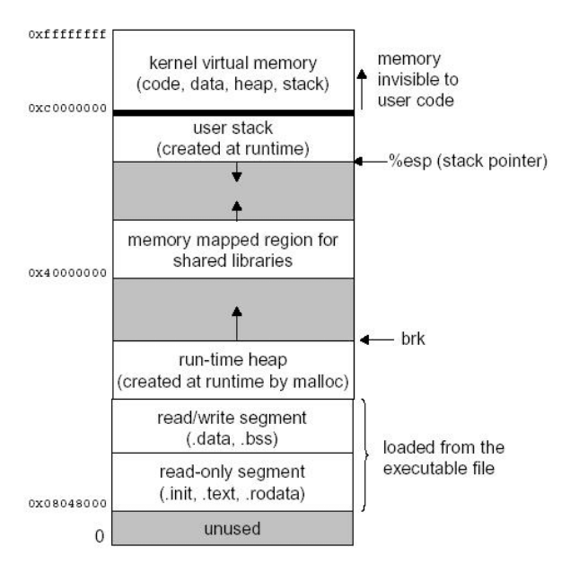
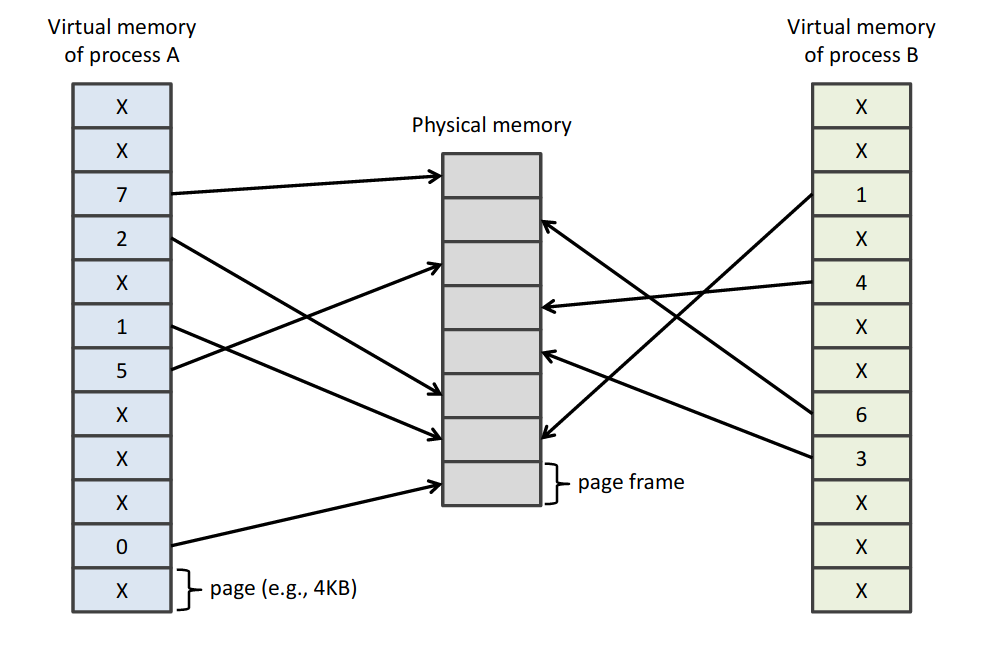

## OS security

### OS felépítése
+ Hardver
+ Driverek
+ Kernel
+ Kernellel interaktóló processzek

### Monolitikus kernel
+ egy nagy blob mindennel benne
+ Linux, WIndows
+ security issue mivel sok dolog van benne

### Microcernel
+ a kernel privileged része kicsi
+ performance rosszabb security jobb

### File access control -- Linux
+ User megprobálja elérni a fájlt, ezt ellenőrzi egy access control policy és ha igen mehet
+ subject : aki akarja elérni a fájlt
+ object: a fájl
+ access operation: az elérés, pl írás / olvasás
+ Reference monitor: aki nézi az access control policy-t hogy ez szabályos e

### Object and subject in linux
+ oject: file
  + linuxon a memórián kivűl minden fájl
+ Subject: a process amit a user indít
+ minden fájlnak van ownerje  gropja ez alapján van megadva az access control
+ úgy néz ki a fájl leírása hogy:
  + első karakter: mappa vagy sem d/-
  + 3 karakter a owner jogosultságai állt rwx
  + 3 karakter group jogosultságai
  + 3 karakter mindenki más jogosultságai
+ ha fájl:
  + r - read
  + w - write
  + x - execute
+ Ha mappa/directory:
  + r - list contents
  + w - create files
  + x - a mappában használni/futattni fájlokat
  + t - sticky bit  limit delete

### Linux authorization mechanism
+ kernel szinten fut
+ fájl megnyitásakor fut le
  + alkalmazás mondja mit mivel akar csinálni
  + kap egy descriptor-t ami egy tokenként működik hogy ezt csinálhatja

### Processes

### PCB -- Process control block
+ processekrol tarolja az infót
+ kernel használja
+ Tartalma:
  + PID
  + scheduling state
  + Program counter
  + CPU registerek
  + Memory management
  + Process felépítése
  + Processzek közötti kommunikáció
  + Account info

### Új process létrehozása
+ Fork/exec linuxon
+ Create process windowson

### SYSTEM CALLS
basic leírás van a dián érdekel olvasd el már unom ezt a sok bullshitet :(

### x86 and x64 protection rings
+ kisebb = higher privilidge
+ intelen 4 van
  + 0 = kernel
+ Linux és windows használ 2-t
  + kernel a 0-n és userspace a 3-an
+ Modern rendszereken vannak negatív ringek

### MEMORY PROTECTION (X64 AND X86) -- Finally something about security

+ virtuális memória:
  + a címek nem fizikaiak
  + OS és a hardver mappeli őket
+ Pagin
  + page framekben az adat

+ MMU  menedszeli
+ protection bitek a védetség menedszelésére
  + R/W: 0 read only 1 read-write
  + U/S: 0 supervisor 1 user

### Translation Lookaside Buffers
+ cache for frequently used pages
+ MMU checks this first

### Segmentation
+ határok app memóriák között
+ nem lehet a határokat átlépni -- CPU nézi

.
